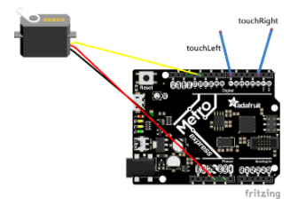
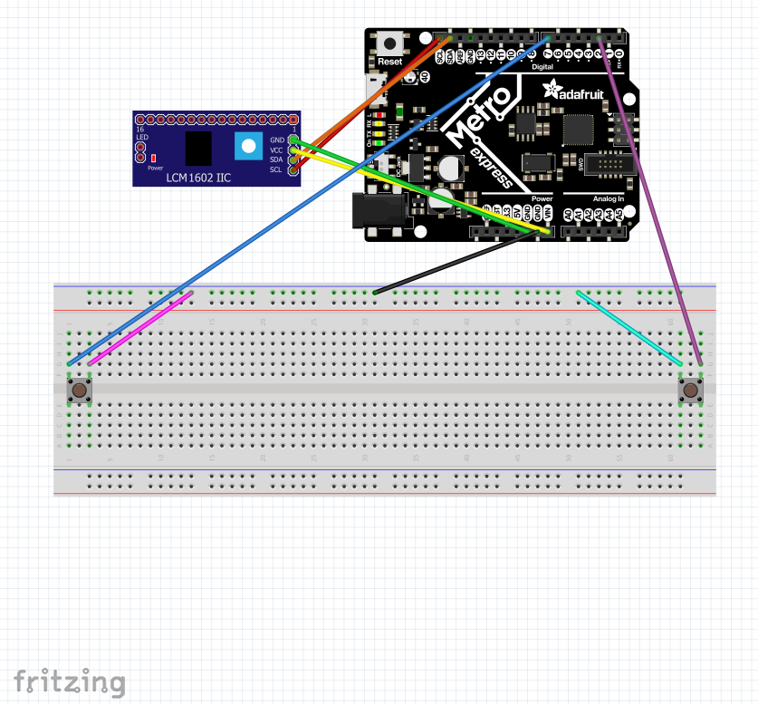
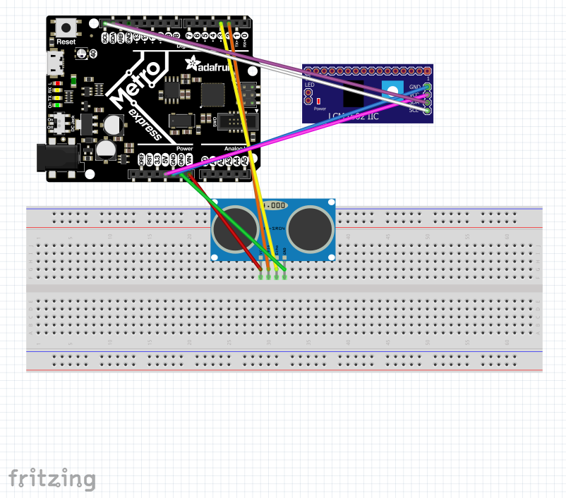

# Code-Programs
This is a repository for my coding projects.

---
## Table of Contents 
* [Table of Contents](#Table-of-Contents)
* [Getting Started](#Getting-Started)
* [Servo Control With Capacitive Touch](#Servo-Control-With-Capacitive-Touch)
* [CircuitPython LCD](#CircuitPython-LCD)
* [CircuitPython Photointrerruptor](#CircuitPython-Photointerrupter)
* [CircuitPython Distance Sensor](#CircuitPython-Distance-Sensor)

---

## Getting Started

### Description

This was my first time ever seeing Circuit Python and a Metro Express board! Overall, my first experience with both of these programs was positive. I ran into some technical difficulties at the start, but was able to overcome them by looking up the instructions created by Adafruit and recieving help from Mr. H. I did not complete any assignments this week, I was mostly getting used to Circuit Python and figuring out how to use the program.

### Reflection

The program does not seem very difficult, however, since I am still getting started I expect to run into some problems. Although, I know that I will be able to overcome the issues I encounter with time and more getting used to using Circuit Python.

---

## Servo Control with Capacitive Touch

### Description

In this assignment, I had to make a servo move from 0 degrees to 180 degrees by touching two different wires. One wire would make the servo turn one direction, and the other wire would mame it turn the opposite direction. 

### Image


* I got this image from Dr. Shields

### Code
```python
#Lucas Fuller
#Circuit Python Servo Control with Touch
#In this assignment I will make a servo turn on direction when a wire is touched,
  #and it will turn the other direction when a different wire is touched.

import board
import time
import pulseio
import servo
import touchio

# This is the setup for the servo pin
pwm = pulseio.PWMOut(board.A3, duty_cycle=2 ** 15, frequency=50)

my_servo = servo.ContinuousServo(pwm)

# This defines the two capacative touch wires
touch_A1 = touchio.TouchIn(board.A1)
touch_A2 = touchio.TouchIn(board.A2)


while True:

    if touch_A1.value:
        print("touched a1") # States which wire is being touched
        my_servo.throttle = 1 # Moves to 180
        
    if touch_A2.value:
        print("touched a2") # States the other wire is being touched
        my_servo.throttle = -1 # Moves to 0

    time.sleep(0.01)
```
### Problems

During the process of this project I ran into a number of problems. First off, since this was a new project and I had never worked with a PWM pin before, I had to reference some of my friend's githubs; Owen McKenney and Graham Lenert, which I found to be extremely helpful. After wiring up my circuit and writing my code, I ran into a series of issues when trying to run my code. I had two issues regarding libraries in my code. One of the libraries wasn't needed, so that was an easy fix however the other was needed. In order to resolve my other library issue, I had to download a bundle and import a servo library in order for my circuit to function. After doing this, I made a couple of edits to my code and my project was up and running. 

### What I learned!

I learned how to make a servo turn but instead of using buttons I learned how to use capacitive touch with wires. 

---

## CircuitPython LCD

### Description

In this assignment, I had the LCD display how many times a button was pressed, and whethere it was counting up or down. 

### Image 



### Code

``` python
# Lucas Fuller
# CircuitPython LCD

from lcd.lcd import LCD
from lcd.i2c_pcf8574_interface import I2CPCF8574Interface
# some LCDs are 0x3f... some are 0x27.
lcd = LCD(I2CPCF8574Interface(0x3f), num_rows=2, num_cols=16)
import touchio
import board
import time
import touchio

touch_A0 = touchio.TouchIn(board.A0)  # Defines the pin which the first wire is in.
touch_A1 = touchio.TouchIn(board.A1)  # Defines which pin the second wire is in.

x = 0
y = 1

while True:
    if touch_A0.value:
        lcd.clear()
        x = x + 1
        lcd.print(str(x))
        while touch_A0.value:
            print("HelloA0")
    if touch_A1.value:
        lcd.clear()
        x = x - 1
        lcd.print(str(x))
        while touch_A1.value:
            print("HelloA1")
```
### Problems

Majority of my problems came when trying to download and install certain libraries onto my Metro. Overall, this project was one of the more difficult ones I have completed. 

### What I learned

I learned how to show the number of times a button was pressed and how to reverse the direction the button was counting. 

---

## CircuitPython Distance Sensor

### Description

In this assignment I had design a project to count upward every time an object went between the arms of the photointerrupter. Furthermore, I had to print the amount of times it was interrupted to the LCD every 4 seconds. 

### Image 



### Code
```python
# Lucas Fuller

import board
import math
import time
import digitalio
import adafruit_bus_device


photoPin = digitalio.DigitalInOut(board.D8)
photoPin.direction = digitalio.Direction.INPUT
photoPin.pull = digitalio.Pull.UP

lastTime = time.monotonic()

isInterrupted = True
counter = 0

while True:
    if time.monotonic() > lastTime + 4:
        lastTime = time.monotonic()
        print('         ')
        print(str(counter))
    if photoPin.value and not isInterrupted:
        counter += 1
        isInterrupted = True
    if not photoPin.value:
        isInterrupted = False
```

I used snippets of code from my friend William Keenan who was a great help to me in completing this assignment. His username is willhk10, go check out his Github!

### Problems


### What I learned


---

## CircuitPython Distance Sensor

### Description

In this assignment I had to use a distance sensor, and map the distances of how far away something is from the sensor. The color of the onboard neopixel on my Metro corresponded to the distance of how far away the object was, I used my hand.

### Image 


### Code
``` python
# Lucas Fuller
# Circuit Python Distance Sensor

import time
import board
import neopixel
from adafruit_hcsr04 import HCSR04
trig = board.D2
echo = board.D3
sonar = HCSR04(trig, echo)
dot = neopixel.NeoPixel(board.NEOPIXEL, 1)
red = 225
green = 0
blue = 0

distance =0

while True:
    dot.fill((red, green, blue))
    if distance<=20:
       red = 255-(12*distance)
       blue = 0+(12*distance)
       green = 0
    elif distance >20:
        green = 0+(12*(distance-20))
        blue = 225-(12*(distance-20))
        red = 0
    if red<=0:
        red =0
    if blue >=225:
        blue =225
    if blue <=0:
        blue = 0
    if green >=225:
        green = 225


    try:
        print (int(sonar.distance))
        distance = (int(sonar.distance))
    except RuntimeError:
        pass
    time.sleep(0.05)
    
```

### Problems

My friends Miles Kershner and Pieter Halvorson Taylor, (mkershn16 and phalvor47), helped me with all of the problems that I had on this project. 

### What I learned

With the help of my good friends, I learned how to use a Distance Sensor to map and show how far away an object is by changing the color of the neopixel on a Metro. 

---
